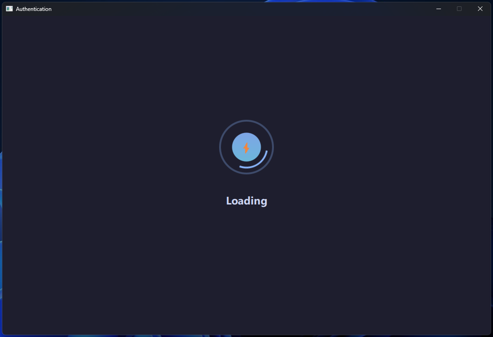
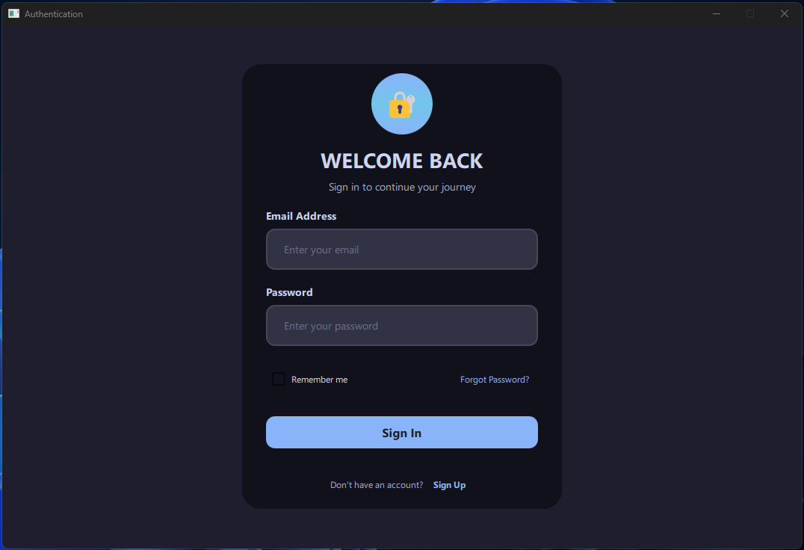

# Qt Authentication

A small Qt-based authentication demo implementing a login flow with a QML front-end and C++ core. This repository contains the application sources, QML UI, and build scripts (CMake) used to produce a cross-platform desktop application.

## Highlights

- Modern QML UI for a compact login screen and a loading state.
- Clean separation between C++ core logic and QML UI.
- CMake-based build system compatible with Qt 6 and Qt Creator.

## Screenshots

Loading screen:



Login form:



## Project structure

Key folders and files:

- `src/` — application source code
  - `Core/Authentication/` — C++ authentication implementation (e.g. `LoginAuthentication.cpp`/`.h`)
  - `Main/` — application entry and build artefacts
  - `Qml/` — QML UI files (`Main.qml`, `Login.qml`, `Loading.qml`, etc.)
- `docs/images/` — project images and screenshots
- `CMakeLists.txt` — top-level CMake file

## Requirements

- Qt 6 (tested with Qt 6.9.x and 6.10.x)
- CMake 3.16+
- A C++17-capable compiler (MinGW or MSVC on Windows)

## Build and run (Windows, PowerShell)

1. Create a build directory and configure with CMake:

```powershell
mkdir build; cd build
cmake -S .. -B . -G "Ninja" -DCMAKE_BUILD_TYPE=Debug
```

2. Build the project using ninja or your chosen generator:

```powershell
ninja
```

3. Run the produced executable from the build output (path will depend on the configured kit). From a Qt Creator kit build directory the binary is usually under a subfolder like `Desktop_Qt_*`.

If you prefer Qt Creator, open the top-level `CMakeLists.txt` in Qt Creator and use the IDE to configure and run with a selected Qt kit.

## Usage

The demo shows a login form that collects credentials and demonstrates an authentication flow handled by `LoginAuthentication` in `src/Core/Authentication`.

This repository is intended as a starting point for embedding authentication into a Qt/QML application. Replace the demo authentication logic with your own secure backend integration (e.g., REST API, OAuth2).

## Contributing

Contributions are welcome. Please open an issue for discussion before submitting larger changes. For small fixes, send a pull request with a concise description and a matching change to tests or documentation when appropriate.

## License

This project does not contain a license file. If you intend to make this project public, add a `LICENSE` file (for example, MIT or Apache-2.0) to clarify reuse terms.

---

If you'd like, I can also:

- Add a `LICENSE` file (suggest MIT or Apache-2.0).
- Add a short CONTRIBUTING.md and CODE_OF_CONDUCT.md.
- Generate a small Windows-specific run helper script.

Let me know which extras you'd like and I'll add them.
